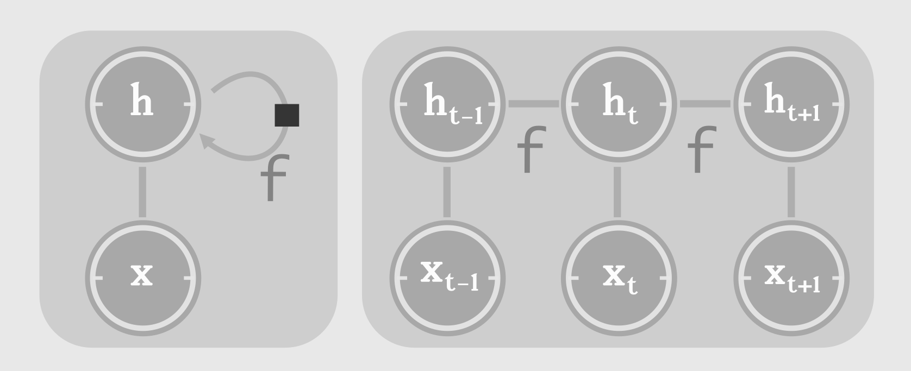
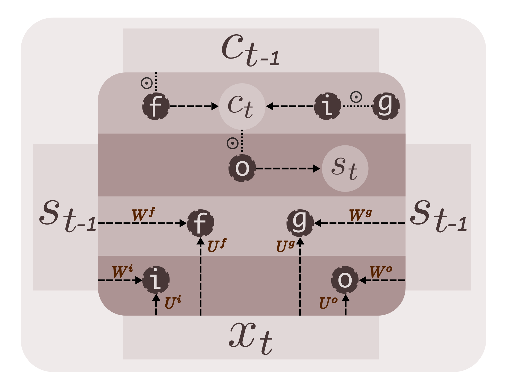
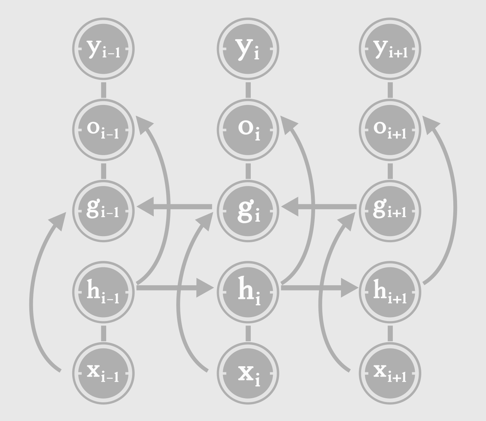
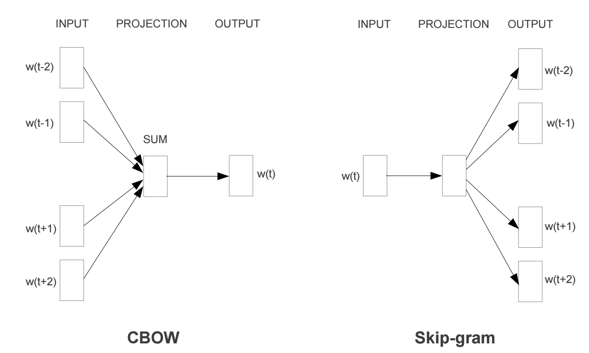
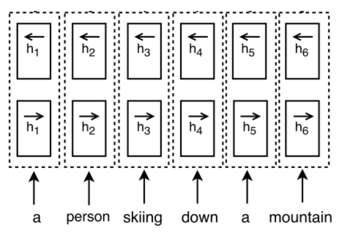
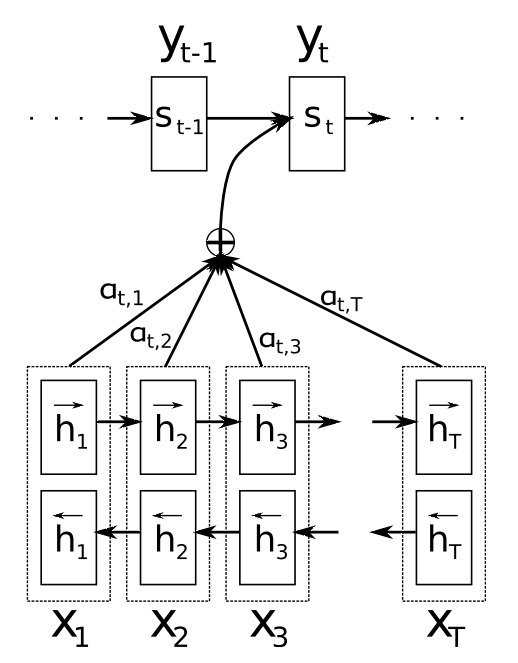
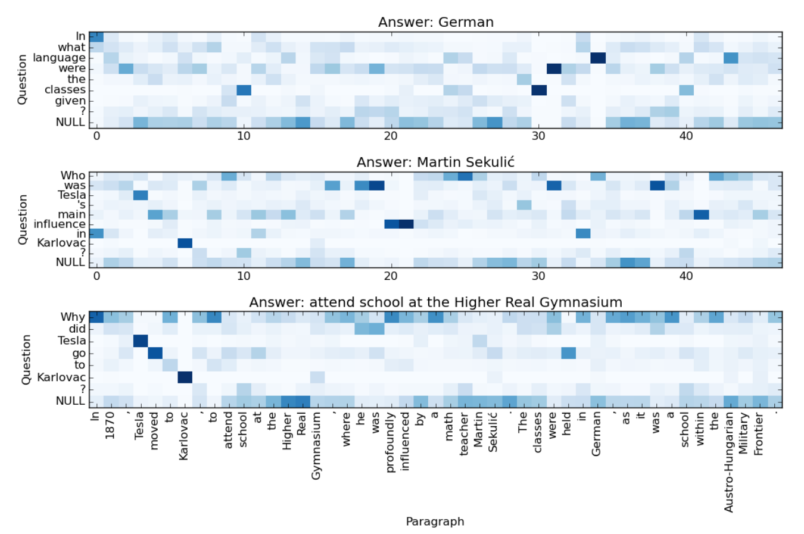

class: middle, center, blackslide

# Machine Reading Comprehension

Suriyadeepan Ramamoorthy

---

# Agenda

1. Question Answering

2. Cloze-style Q/A

3. Recurrent Neural Networks

4. Distributed Word Representation

5. Representation Learning

6. Datasets

---

class: middle, center, blackslide

# Q/A

---

# Question Answering

- AI-complete

> is equivalent to that of solving the central artificial intelligence problem

- Understanding and Reasoning

- Availability of Labeled data

- Neural Network based Models

---

# Areas in Q/A

- **Reading Comprehension**

Answer based on a document

- **Semantic Parsing**

Answer is a query to Knowledge Base

- **Visual QA**

Context is 1 or more images

- **Information Retrieval**

Answer is a paragraph or sentence from a corpus of documents

---

# Types of Tasks

- Cloze style ([CBT](https://research.fb.com/downloads/babi/))

- Factoid questions

- Narrative questions (an explanation/summary as answer)

- Extractive Q/A ([SQuAD](https://rajpurkar.github.io/SQuAD-explorer/))

- Complex/Chained Reasoning ([bAbI](https://research.fb.com/downloads/babi/))

---

class: middle, center, blackslide

# Cloze Style Q/A

---

# Problem Definition

We have a tuple of `\( (d,q,a) \)`

1. **d**ocument is typically a paragraph
2. **q**uestion, based on the document
3. **a**nswer to query

- Global vocabulary **V**
- Fixed answer vocabulary **A**

## Task

Given `\((d,q)\)`, find `\(a \in A\)` 

---

# Sample

> Roman Emperors were rulers of the Roman Empire, wielding power over its citizens and military. The empire was developed as the Roman Republic invaded and occupied most of Europe and portions of northern Africa and western Asia. Under the republic, regions of the empire were ruled by provincial governors answerable to and authorised by the "Senate and People of Rome". Rome and its senate were ruled by a variety of magistrates – of whom the consuls were the most powerful. The republic ended, and the emperors were created, when these magistrates became legally and practically subservient to one citizen with power over all other magistrates. **Augustus, the first emperor**, was careful to maintain the facade of republican rule, taking no specific title for his position and calling the concentration of magisterial power Princeps Senatus (the first man of the senate). This style of government lasted for 300 years, and is thus called the Principate era.

Who is the first Roman Emperor?

---

# Model

- Most models rely on RNN

### Recurrent Neural Networks

- Sequence processing

- Stateful

- repeated application of kernel

- **Gated Bi-directional** RNN

---

class: center, middle, blackslide

# Recurrent Neural Networks

---

class: center

# Recurrent Neural Network

`\(h_t = \phi( Uh_{t-1} + Wx_t ) \)`

---

class: center

# Long Short Term Memory

---

class: center

# Bidirectional RNN

`\(h_t = h_t^f = \phi( U^fh^f_{t-1} + W^fx_t ) \)`

`\(g_t = h_t^b = \phi( U^bh^b_{t-1} + W^bx_t ) \)`

---

class: center, middle, blackslide

## Distributed Word Representation

---

# Word Embedding

Mapping symbols to continous space

---

# Pretrained word vectors

- [**Glove**](https://nlp.stanford.edu/projects/glove/)
	- Co-occurance Probabilities

- [**word2vec**](https://code.google.com/archive/p/word2vec/)
	- CBOW, Skip-gram

	

---

# Hybrid Embedding

- Word-level Representation
	- Frequent verbs, prepositions and common nouns

- Character-level Representation
	- OOV words, rare words
	- Named Entities (location, name, etc,.)

- Composition of Character and Word Embeddings

- Concat vectors or element-wise multiplication

---

class: center, middle, blackslide

# Representation Learning

---

# Representation

- Continous Space Representation of passage and query

$$ P \in \mathbb{R}^{l_p \times d_e} $$
$$ Q \in \mathbb{R}^{l_q \times d_e} $$

- LSTM Preprocessing 

$$ H^p = \overleftrightarrow{LSTM}(P) \in \mathbb{R}^{l_p \times d_h} $$
$$ H^q = \overleftrightarrow{LSTM}(Q) \in \mathbb{R}^{l_q \times d_h} $$

---

class: center

# LSTM Preprocessing

`\( h_i = [\overrightarrow{h_i}, \overleftarrow{h_i}] \)`

`\( H^p = [ h_1, h_2, ... h_{l_p} ] \)`

`\( h_i \in \mathbb{R}^{d_h} \)`

---

# Attention Mechanism

Match between passage and question

- Multiplicative/Additive integration

- Soft/Hard attention

---

class: center

# Attention Mechanism

---

# Output

- `\( P(c|d,q)\)` - softmax over inner product between `\(H^q\)` and the output of the last layer.

- Predicted Answer 

$$ \hat{a} = argmax_{(c \in A)} \space P(c|d,q) $$

---

class: center, middle, blackslide

# Datasets

---

# bAbI

- 20 Reasoning tasks

- Relational Reasoning, Counting 

- Deductive Reasoning, Inductive Reasoning

- Path Finding

> The office is south of the garden.  The garden is west of the bedroom.  The bathroom is east of the bedroom.  The bedroom is north of the hallway.  The kitchen is north of the garden.

**Query**

> How do you go from the bedroom to the kitchen?    

**Answer** : \>\> [`west`](#) \>\> [`north`](#)

---

# CNN/DailyMail

>  <small>@entity0 , @entity1 ( @entity2 ) her second floor cafe on a dusty industrial road was painted with dashes of psychedelic colors . and @entity8 surrounded herself there with books , people , and discussions on technology , human rights and women 's entrepreneurship . introducing others to [`@entity18`](#) , street art , and talking politics was not supposed to get her killed . but in @entity1 , free speech is dangerous , and @entity23 's exuberant exercise of it made her stick out nationwide . two gunman shot her dead at point - blank range late friday after she locked up @entity31 cafe in @entity32 for the night , police said . @entity23 died from five bullet wounds . the gunmen also shot her mother . she is in a hospital but is expected to be released on time for her daughter 's funeral . @entity23 's killing broke hearts beating for non-violence and progressive values across the country .... </small>

**Query**

> @entity23 loved books , @placeholder and discussions about human rights

**Lookup**

> <small> @entity31:The Second Floor @entity2:CNN @entity1:Pakistan @entity0:Islamabad @entity106:T2F @entity177:Marilyn Monroe @entity23:Mahmud @entity163:Vespa @entity178:Seven Year Itch @entity8:Sabeen @entity18:Jimi Hendrix
</small>

---

# CBT

> So they had to fall a long way .	So they got their tails fast in their mouths .	So they could n't get them out again .	That 's all .	 Thank you , " said Alice ,  it 's very interesting .	I never knew so much about a whiting before . "	 I can tell you more than that , if you like , " said the Gryphon .	 Do you know why it 's called a whiting ? "	 I never thought about it , " said Alice .	 Why ? "	 IT DOES THE BOOTS AND SHOES . '	the Gryphon replied very solemnly .	Alice was thoroughly puzzled .	 Does the boots and shoes ! "	she repeated in a wondering tone .	 Why , what are YOUR shoes done with ? "	said the Gryphon .	 I mean , what makes them so shiny ? "	Alice looked down at them , and considered a little before she gave her answer . They 're done with blacking , I believe . "	

**Query** 

>  Boots and shoes under the sea , " the XXXXX went on in a deep voice ,  are done with a whiting ".

**Candidates** : `Alice|BOOTS|Gryphon|SHOES|answer|fall|mouths|tone|way|whiting`
	
**Answer** : [`gryphon`](#)

---

# SQuAD

> In 1870, Tesla moved to Karlovac, [`to attend school at the Higher Real Gymnasium`](#) , where he was profoundly influenced by a math teacher Martin Sekuli´ c. The classes were held in German, as it was a school within the Austro-Hungarian Military Frontier. Tesla was able to perform integral calculus in his head, which prompted his teachers to believe that he was cheating. He finished a four-year term in three years, graduating in 1873.

**Query** : 

> Why did Tesla go to Karlovac?

---

class: center, middle

# Thank You!

---

# Reference

<small><i>
- [Towards AI-Complete Question Answering: A Set of Prerequisite Toy Tasks](https://arxiv.org/abs/1502.05698)

- [AI Research in the 21st Century](http://monicasmind.com/?p=188)

- [Childrens Book Test](https://research.fb.com/downloads/babi/)

- [Stanford Question Answering Dataset](https://rajpurkar.github.io/SQuAD-explorer/)

- [bAbI](https://research.fb.com/downloads/babi/)

- [Recurrent Neural Networks](http://karpathy.github.io/2015/05/21/rnn-effectiveness/)

- [Long Short Term Memory](http://dl.acm.org/citation.cfm?id=1246450)

- [Deep Learning for NLP Best Practices](http://ruder.io/deep-learning-nlp-best-practices/)

</i></small>

---

# Reference

<small><i>
- [On Word Embeddings](http://ruder.io/word-embeddings-1/index.html)

- [Glove : Global Vecotrs for Word Representation](https://nlp.stanford.edu/projects/glove/)

- [word2vec : Efficient Estimation of Word Representations in Vector Space](https://arxiv.org/abs/1301.3781)

- [Neural Machine Translation by Jointly Learning to Align and Translate](https://arxiv.org/abs/1409.0473)

- [Machine Comprehension Using Match-LSTM and Answer Pointer](https://arxiv.org/abs/1608.07905)

- [A Thorough Examination of the CNN/Daily Mail Reading Comprehension Task](https://arxiv.org/abs/1606.02858)

</i></small>
